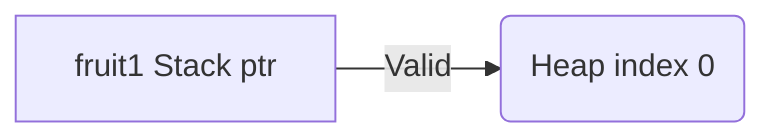
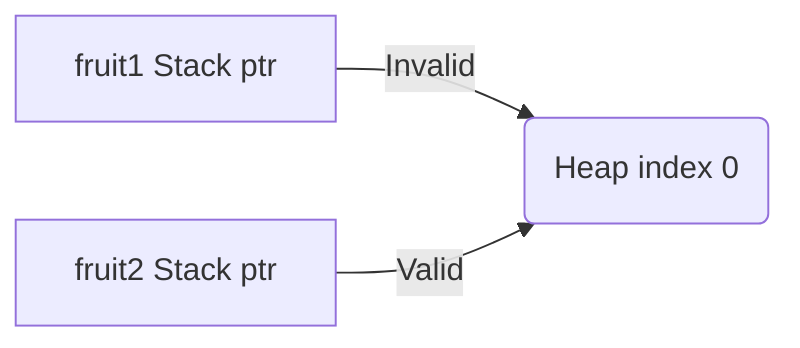

# Ownership

Rust manages computer memory through **ownership rules** without memory leaks and runtime slowness. Unlike other languages with garbage collection or manual memory allocation, Rust's compiler enforces ownership rules. If violated, the program won't compile, ensuring efficient memory management.

## Variable Scope

A scope is an area within the code block for which a variable is valid. In Rust, the scope of a variable defines its ownership.

Example:
```rust
// `name` is invalid and cannot be used here 
// because it's outside the scope of code block{}
{ // code block starts here
    let name = String::from("hello rust!");   // `name` is valid from this point forward
    
    // do stuff with `name`
} // code block ends
// this scope ends, `name` is no longer valid and cannot be used
```

Here the variable `name` is only available inside the code block, i.e., between the curly braces `{}`. We cannot use the `name` variable outside the closing curly brace.

**Whenever a variable goes out of scope, its memory is freed.**

## Ownership Rules

Rust has some ownership rules. We must keep these rules in mind while working with Rust:

1. Each value in Rust has an owner.
2. There can only be one owner at a time.
3. When the owner goes out of scope, the value will be dropped.

## Data Move

Sometimes, we might not want a variable to be dropped at the end of the scope. Instead, we want to transfer ownership of an item from one variable to another.

Here's an example to understand data movement and ownership rules in Rust.
```rust
fn main() {
    // rule no. 1 
    // String value has an owner variable `fruit1`
    let fruit1 = String::from("Banana");
    
    // rule no. 2
    // only one owner at a time
    // ownership moves to another variable `fruit2`
    let fruit2 = fruit1;
    
    // rule no. 3
    // error, out of scope, value is dropped
    println!("fruit1 = {}", fruit1); // prints → error
    // cannot print variable fruit1 because ownership has moved
    
    // print value of fruit2 on the screen
    println!("fruit2 = {}", fruit2); // prints → Banana
}
```

Here, `fruit1` was the owner of the String.

A `String` stores data both on the `stack` and the `heap`. This means that when we bind a `String` to a variable `fruit1`, the memory representation looks like this:

**Stack(fruit1)**
| Name     | Value |
| -------- | ----- |
| ptr      | -->   |
| length   | 6     |
| capacity | 6     |

**Heap**
| Index | Value |
| ----- | ----- |
| 0     | B     |
| 1     | a     |
| 2     | n     |
| 3     | a     |
| 4     | n     |
| 5     | a     |




A `String` holds a pointer that points to the memory that holds the content of the string, a length, and a capacity in the stack. The heap holds the contents of the `String`.

Now, when we assign `fruit1` to `fruit2`, this is how the memory representation looks like:

**Stack(fruit2)**
| Name     | Value |
| -------- | ----- |
| ptr      | -->   |
| length   | 6     |
| capacity | 6     |



Rust will invalidate (drop) the first variable `fruit1`, and move the value to another variable `fruit2`. This way two variables cannot point to the same content. **At any point, there is only one owner of the value.**

> **Note:** The above concept is applicable for data types that don't have fixed sizes in memory and use the heap memory to store the contents.

## Data Copy

Primitive types like Integers, Floats and Booleans don't follow the ownership rules. These types have a known size at compile time and are stored entirely on the stack, so copies of the actual values are quick to make.

Example:
```rust
fn main() {
    let x = 11;
    
    // copies data from x to y
    // ownership rules are not applied here 
    let y = x;

    println!("x = {x}, y = {y}"); // prints x = 11, y = 11
}
```

Here, `x` variable can be used afterward, unlike a `move` without worrying about ownership, even though `x` is assigned to `y`.

This copying is possible because of the `Copy` trait available in primitive types in Rust. When we assign `x` to `y`, a copy of the data is made.

> **Note:** A `trait` is a way to define shared behavior in Rust. We will discuss the traits later.


## Ownership in Functions

Passing a variable to a function will also move or copy the value, just as an assignment. 
- Stack allocated types will copy the data when passed into a function.
- Heap allocated data types will move the ownership of the variable to the function.

### Passing String to a function
```rust
fn main() {
    // fruit comes into scope
    let fruit = String::from("apple");
    
    // ownership of fruit moves into the function
    print_fruit(fruit); // prints → apple
    // fruit is moved to the function so is no longer available here
    
    println!("fruit = {}", fruit); // error
}

fn print_fruit(str: String) {   // str comes into scope
    println!("str = {}", str);
}   // str goes out of scope and is dropped, plus memory is freed
```

Here, the value of the `fruit` variable is moved into the function `print_fruit()` because `String` type uses heap memory.

### Passing Integer to a function
```rust
fn main() {
    // number comes into scope
    let number = 10;
    
    // value of the number is copied into the function
    print_number(number);
    
    // number variable can be used here
    println!("number = {}", number);
}

fn print_number(value: i32) { // value comes into scope
    println!("value = {}", value);
}   // value goes out of scope and is dropped, plus memory is freed
```

Here, the value of the `number` variable is copied into the function `print_number()` because the `i32` (integer) type uses stack memory.

## Ownership table

A table summarizing types that implement the `Copy` trait and types that are typically heap-allocated.

- Types that implement `Copy` trait have their values copied when assigned to another variable, preventing ownership transfer.
- Heap-allocated types involve ownership transfer because they are dynamically allocated on the heap, and ownership needs to be managed properly.
- Whether a compound or custom type implements `Copy` depends on its internal structure.


| Type      | Implements `Copy` | Heap-Allocated | Ownership Transfer |
| ---------------- | ----------- | ----------------- | -------------- |
| Integer Types                  | Yes               | No             | No                 |
| Floating-Point Types           | Yes               | No             | No                 |
| Character Type                 | Yes               | No             | No                 |
| Boolean Type                   | Yes               | No             | No                 |
| Tuple (if elements are `Copy`) | Yes               | No             | No                 |
| Array (if elements are `Copy`) | Yes               | No             | No                 |
| Structs (if fields are `Copy`) | Yes               | No             | No                 |
| String                         | No                | Yes            | Yes                |
| Vec                            | No                | Yes            | Yes                |
| HashMap, HashSet               | No                | Yes            | Yes                |
| Custom Types                   | Depends           | Depends        | Depends            |
