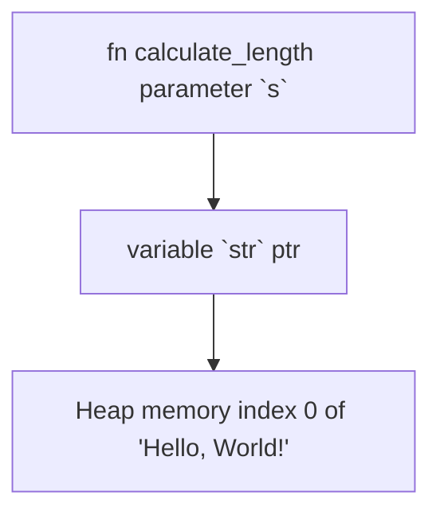

# Rust References and Borrowing

**References** in Rust allow us to point to a value without owning it. This means that the original owner of the value remains same, enabling multiple parts of the code to access the same data without introducing data races.

References are helpful when passing values to a function without moving the ownership of the value. And this creation of a reference is known as **borrowing** in Rust.

There are two types of references:

- **Immutable References (`&T`):** Allow read-only access.
- **Mutable References (`&mut T`):** Allow read-write access, but only one mutable reference to a piece of data is allowed within a specific scope to prevent data races.

## Understand references

Let's take an example,
```rust
fn main() {
    let str = String::from("Hello, World!");
    
    // Call function with reference String value
    let len = calculate_length(&str);

    println!("The length of '{str}' is {len}.");
    // prints → The length of 'Hello, World!' is 13.
}

// Function to calculate length of a string
// It takes a reference of a String as an parameter
// and returns integer value
fn calculate_length(s: &String) -> usize {
    s.len()
}
```

In the above example, we define a function called `calculate_length()` which takes a `&String` type as an parameter.

The important part here is that `s` is a reference to a `String` and it doesn't take ownership of the actual value of `String`.

**A diagram of &String `s` pointing at String `str`**



> **Note:** I would not create stack and heap memory anymore as you have already saw it in the Ownership note.

```rust
fn calculate_length(s: &String) -> usize { // s is a reference to a String
    s.len()
}
```

Here, `s` goes out of scope, at the end of the function `calculate_length()`, but it is not dropped because it does not have ownership of what it refers to.

```rust
let str = String::from("Hello, World!");
let len = calculate_length(&str);
```

The `&str` syntax while calling the function lets us create a reference that refers to the value of `str` but does not own it.

The action of creating a reference is known as **borrowing**. Borrowing is when we borrow something, and we are done with it, we give it back. It doesn't make us the owner of the data.

> **Note:** Ampersand (`&`) represents references, and they allow us to refer to some value without taking ownership of it.
>
> The opposite of referencing by using `&` is *dereferencing*, which is accomplished with the dereference operator, `*`.

## Modifying References

By default a reference is always immutable. However, we can use the `&mut` keyword to make a reference mutable, also the variable, you are referring to will also have to be mutable.

Example:
```rust
fn main() {
    let mut str = String::from("Hello");
    
    // before modifying the string
    println!("Before: str = {}", str); // prints => Hello

    // pass a mutable string when calling the function
    change(&mut str);
    
    // after modifying the string
    println!("After: str = {}", str); // prints => Hello, World!
}

fn change(s: &mut String) {
    // push a string to the mutable reference variable
    s.push_str(", World!");
}
```

Here, we set the variable `str` to be mutable. Then we create a mutable reference with `&mut str`, and call the `change()` function with a mutable reference `s: &mut String`.

This allows the `change()` function to modify the value it borrows. Inside the `change()` function, we push a string with `s.push_str(", World!")` to the reference string.


## Rules for References

- You can have many immutable references or one mutable reference, but not both at the same time.
- References must always be valid i.e. the data they point to must outlive the reference.
- You cannot modify data through an immutable reference.
- Mutable references enforce exclusive access to the data, preventing data races.

> You must follow this rules while creating references.

### Example of multiple immutable reference

In Rust, you can have multiple immutable references to the same data at the same time.

```rust
fn main() {
    let x = 42;

    // Creating multiple immutable references
    let ref1 = &x;
    let ref2 = &x;

    println!("Value of x: {}", x);
    println!("Value of reference1: {}", *ref1);
    println!("Value of reference2: {}", *ref2);
}
```

In this example, `reference1` and `reference2` are both immutable references to the value of `x`. They are allowed to coexist because they are only reading the data, not modifying it. The `println!` statements demonstrate that you can use both references to read the value of `x` using dereference operator `*`.

It's important to note that multiple immutable references are permitted because they don't introduce the risk of *data races*. If any of these references were trying to modify the data, the Rust compiler would catch it at compile time.

> **Note:** In Rust, the dereference operator `*` is used to access the value that a reference is pointing to. When you have a reference, you use the `*` operator to **"dereference"** it and access the actual value it refers to.

### Example of multiple mutable reference

If you have a mutable reference to a value, you can have no other references to that value.

```rust
fn main() {
    let mut str = String::from("hello");

    // mutable reference 1
    let ref1 = &mut str;

    // mutable reference 2
    let ref2 = &mut str;

    println!("{}, {}", ref1, ref2); // prints => Error
    // cannot borrow `str` as mutable more than once at a time
}
```

Rust's rule against having multiple mutable references to the same data(variable) at the same time is like a safety measure. It means you can change data, but in a careful way. The cool part is that Rust can catch and stop potential issues called data races before your code even runs.

A data race is a problem when:
1. Two or more pointers are trying to look at the same data at the exact same time.
2. At least one of these pointers is trying to change the data.
3. There's no plan(mechanism) to organize how these changes happen.

Data races can mess things up really badly and are tricky to find and fix when you run your program. Rust saves you from this headache by not letting you compile code that could cause data races!

> It's also important to note that the dereference operator `*` is can be used when working with mutable references to modify the data. For example,
> 
> ```rust
> fn main() {
>    let mut y = 5;
>    // Creating a mutable reference to the value of y
>    let reference = &mut y;
>    // Using the dereference operator to modify the value
>    *reference += 10;
>    println!("Updated value of y: {}", y);
> }
> ```

### Example of both references at the same time

In Rust, you can't have both mutable and immutable references to the same data at the same time. This is because allowing both would risk unexpected changes to the data. Rust enforces this rule to ensure that code remains predictable and safe.

```rust
fn main() {
    let mut s = String::from("hello");

    let r1 = &s;     // No problem, immutable reference
    let r2 = &s;     // No problem, another immutable reference
    let r3 = &mut s; // BIG PROBLEM, can't have mutable reference here
    // cannot borrow `s` as mutable because it is also borrowed as immutable

    println!("{}, {}, and {}", r1, r2, r3);
}
```

The error you see when compiling this code is because Rust doesn't allow a mutable reference (`r3`) to coexist with immutable references (`r1` and `r2`) to the same data. This rule ensures that when you're reading data immutably, you can trust that it won't change.

To make it more concrete, think about it like this: if someone lends you a book (immutable reference), you can't start writing in it or tearing out pages.

Now, even though you can't have both mutable and immutable references that overlap in scope, you can have them sequentially, where the immutable references finish before the mutable reference begins.

Example:
```rust
fn main() {
    let mut s = String::from("hello");

    let r1 = &s;          // No problem, immutable reference 1
    let r2 = &s;          // No problem, immutable reference 2
    println!("{} and {}", r1, r2);
    // r1 and r2 are no longer used after this point

    let r3 = &mut s;      // No problem, mutable reference
    println!("{}", r3);
}
```

In this code, we first create two immutable references, `r1` and `r2`, to the string `s`. We use them in the `println!` statement and then don't use them anymore. After that, we introduce a mutable reference `r3` to the same string `s`. This works because the immutable references are no longer in use when the mutable reference is introduced.

This separation in time ensures that, at any given moment, there is only one type of reference (mutable or immutable) that has access to the data.

### Dangling References

**A dangling reference occurs when a reference still exists but points to memory that has been deallocated or is otherwise invalid.** In Rust, the borrow checker and ownership system(2nd rule) are designed to prevent dangling references and ensure memory safety.

Consider the following example that would lead to a dangling reference:
```rust
fn main() {
    let reference_to_string: &String;

    {
        // s is a new String
        let s = String::from("hello");
        // assigning reference of String `s`
        reference_to_string = &s; 
    }// Here, s goes out of scope, and is dropped. Its memory goes away.

    // ERROR: `s` is no longer available, leaving `reference_to_string` dangling
    println!("{}", reference_to_string);
    // Oops! `reference_to_string` now points to invalid memory
}
```

In this example, a reference `reference_to_string` is created inside a block, pointing to a `String` created within the same block. However, once the block ends, the `String` (`s`) is deallocated, leaving `reference_to_string` with a dangling reference. Attempting to use `reference_to_string` after the referenced data has been dropped results in undefined behavior and is typically caught by the Rust compiler.
